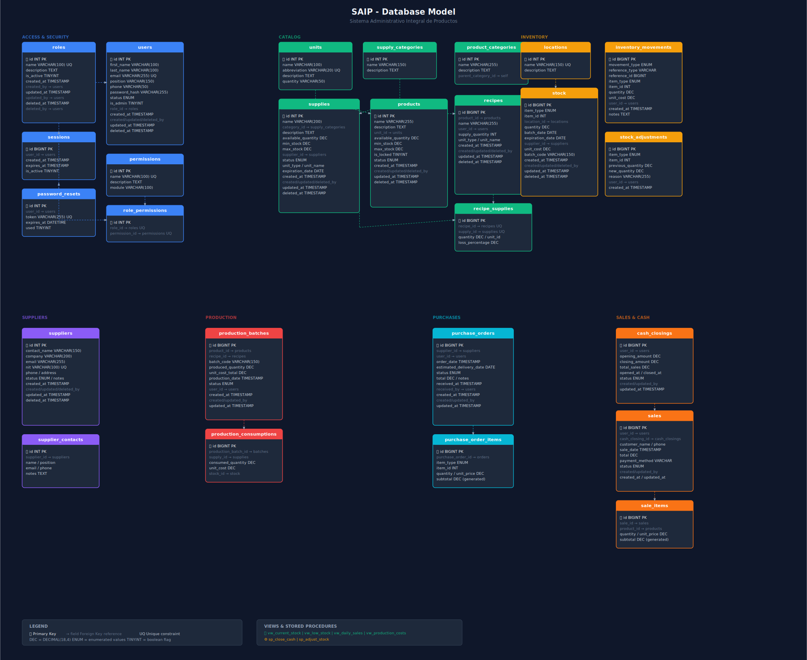

# SAIP - Sistema Administrativo Integral de Productos

## Objetivo del Proyecto

Desarrollar un **Sistema Administrativo Integral de Productos (SAIP)** en plataforma web, diseñado específicamente para pequeñas panaderías como La Parmesana, con el fin de:

- Automatizar y optimizar procesos clave: ventas, inventario, compras, proveedores, producción de materias primas y administración básica.
- Centralizar la información mediante formularios digitales y consultas en tiempo real.
- Reducir errores humanos, pérdidas económicas y carga laboral manual.
- Mejorar la precisión en registros, trazabilidad de producción y proveedores.
- Facilitar la toma de decisiones estratégicas y aumentar la rentabilidad.
- Sentar las bases para escalar a otras panaderías de mediana y amplia capacidad en fases futuras.

## Alcance Inicial

El sistema se enfoca en optimizar procesos transversales de una pequeña panadería familiar:

- Control de inventarios y materias primas
- Registro y gestión de ventas
- Gestión de proveedores y compras
- Producción y registro de materias primas utilizadas
- Administración básica (reportes simples, finanzas elementales)


El proyecto se desarrollará de forma iterativa, comenzando con los módulos prioritarios identificados en el levantamiento inicial.

## Stack Tecnológico

| Capa | Tecnología |
|------|------------|
| **Frontend** | React 19 + TypeScript + Vite + pnpm |
| **Backend** | Python 3.14 + FastAPI + SQLModel |
| **Base de datos** | MySQL 8.0 (Docker) |

---

## Proceso de Instalación

### Requisitos previos

- [Docker](https://www.docker.com/get-started/) y Docker Compose
- [Node.js](https://nodejs.org/) (v18+)
- [pnpm](https://pnpm.io/installation) (`npm install -g pnpm`)
- [Python](https://www.python.org/) 3.14
- [uv](https://github.com/astral-sh/uv) (`curl -LsSf https://astral.sh/uv/install.sh | sh`)

### Pasos

1. **Clonar el repositorio**
   ```bash
   git clone <url-del-repositorio>
   cd saip-proyect
   ```

2. **Configurar variables de entorno**
   ```bash
   cp .env.example .env
   # Editar .env con las credenciales necesarias
   ```

3. **Instalar dependencias del frontend**
   ```bash
   cd F
   pnpm install
   ```

4. **Instalar dependencias del backend**
   ```bash
   cd ../B
   uv sync
   ```

5. **Iniciar la base de datos**
   ```bash
   docker-compose up db -d
   ```

---

## Ejecución del Proyecto

### Modo desarrollo local

```bash
# Terminal 1: Base de datos
docker-compose up db -d

# Terminal 2: Backend (puerto 8000)
cd B
uv run uvicorn src.main:app --host 0.0.0.0 --port 8000 --reload

# Terminal 3: Frontend (puerto 5173)
cd F
pnpm dev
```

### Modo Docker completo

```bash
docker-compose up --build
```

| Servicio | URL |
|----------|-----|
| Frontend | http://localhost:5173 |
| Backend | http://localhost:8000 |

---

## Estructura del Proyecto

```
saip-proyect/
├── F/                          # Frontend (React + TypeScript + Vite)
│   ├── src/
│   │   ├── components/         # Componentes reutilizables
│   │   ├── pages/              # Páginas de la aplicación
│   │   ├── context/            # Contextos (AuthContext.tsx)
│   │   ├── utils/              # Utilidades (api.ts)
│   │   ├── App.tsx             # App principal con routing
│   │   └── main.tsx            # Punto de entrada
│   ├── eslint.config.js        # ESLint 9 flat config
│   └── vite.config.js
├── B/                          # Backend (Python + FastAPI)
│   ├── src/
│   │   ├── main.py             # Punto de entrada FastAPI
│   │   ├── database.py         # Conexión a DB
│   │   ├── security.py         # Utilidades de auth
│   │   ├── models/             # Modelos SQLModel
│   │   ├── routers/             # Rutas de API
│   │   └── schemas/            # Schemas Pydantic
│   └── pyproject.toml
├── docker-compose.yml          # Orquestación Docker
├── saip.sql                     # Schema de la base de datos
├── .env                         # Variables de entorno (no committed)
└── _docs/                       # Documentación de requerimientos
```

---

## Fases del Proyecto (Resumen)

1. **Análisis y Levantamiento**  
   - Identificar requerimientos funcionales y no funcionales  
   - Analizar procesos actuales y oportunidades de mejora  
   - Validar con actores clave (familia propietaria)

2. **Diseño**  
   - Definir arquitectura y estructura del sistema  
   - Modelar procesos (diagramas de casos de uso, flujos, ER)  
   - Diseñar base de datos, interfaces y estándares de accesibilidad

3. **Desarrollo**  
   - Construir módulos principales  
   - Integrar base de datos y funcionalidades

4. **Pruebas**  
   - Unitarias, integración, rendimiento y seguridad  
   - Validación con usuarios reales

5. **Implementación y Soporte**  
   - Puesta en producción  
   - Capacitación a usuarios  
   - Monitoreo inicial y ajustes

¡Bienvenidos al proyecto SAIP!  
Este sistema busca transformar la gestión diaria de La Parmesana en algo más eficiente y sostenible, y servir como base para otras panaderías similares.


## Uso de los componentes reutilizables

Para uso del Layout, se debe usar el siguiente codigo en la vista en donde se desee usar


import Layout from './components/Layout'

export default function Dashboard() {
  return (
    <Layout>
      <h1>Módulos principales</h1>
      {/* tu contenido aquí */}
    </Layout>
  )
}


El Layout ya envuelve automáticamente con Navbar, Sidebar y Footer — solo se el contenido como children (hijo).

### Ejemplo de uso Dashboard.tsx

export default function Dashboard(): JSX.Element {
  return (
    <Layout>
      <h1 style={styles.title}>Módulos principales</h1>
      <div style={styles.grid}>
        {modules.map((mod) => (
          <div key={mod.id} style={styles.card}>
            {mod.icon}
            <div style={styles.cardLabel}>{mod.label}</div>
            <div style={styles.cardDesc}>{mod.desc}</div>
          </div>
        ))}
      </div>
    </Layout>
  );
}


## Modelo de base de datos

